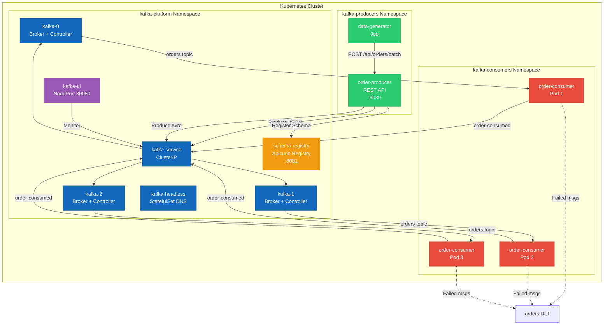
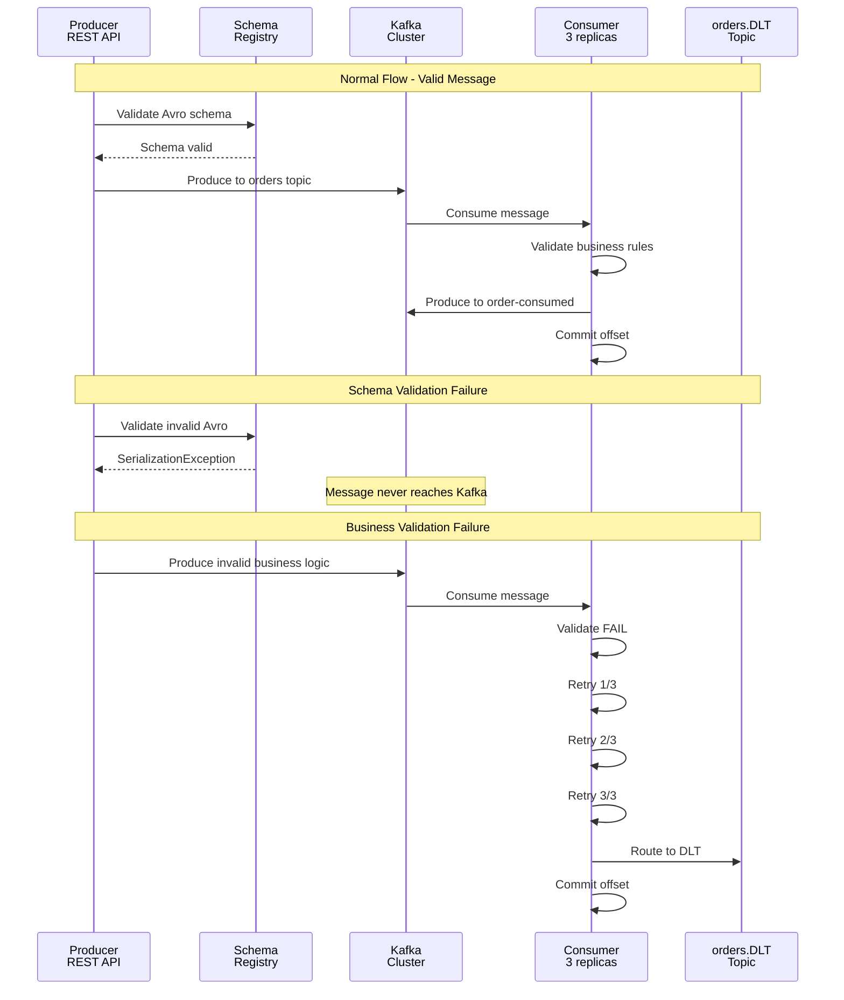
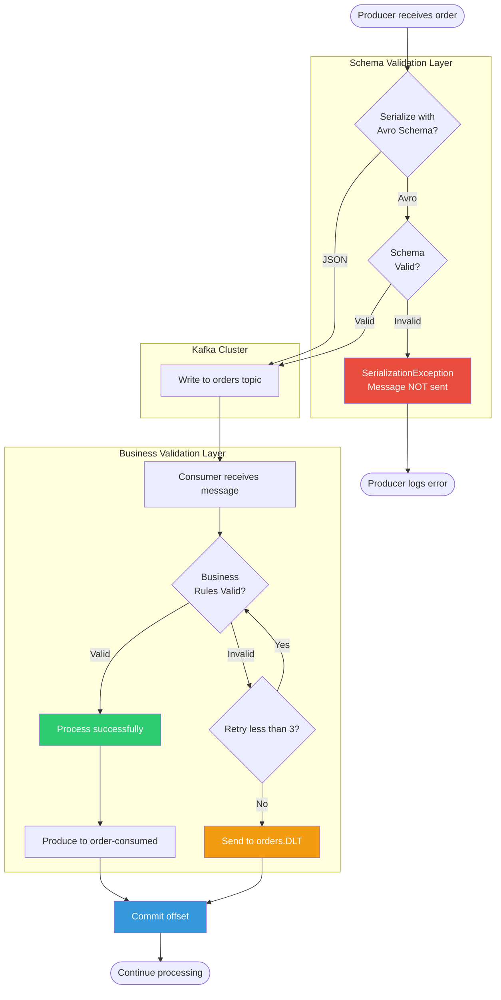

# Multi-Broker Kafka Order Processing Platform

Production-grade, fault-tolerant Apache Kafka cluster deployed on Kubernetes with Spring Boot microservices for order processing.

## Architecture

> **Note:** Mermaid diagrams render automatically on GitHub. If viewing locally, open this file on GitHub or use [Mermaid Live Editor](https://mermaid.live) to view diagrams.




<details>
<summary>ASCII Architecture Diagram (Fallback)</summary>

```
┌─────────────────────────── Kubernetes Cluster ────────────────────────────┐
│                                                                            │
│  ┌─── kafka-platform Namespace ──────────────────────────────────────┐   │
│  │                                                                     │   │
│  │  [Kafka Cluster - KRaft Mode]                                      │   │
│  │   kafka-0    kafka-1    kafka-2                                    │   │
│  │   ⚙️ Broker  ⚙️ Broker  ⚙️ Broker                                 │   │
│  │                                                                     │   │
│  │  🔌 kafka-service (ClusterIP) - Client connections                │   │
│  │  🔌 kafka-headless - StatefulSet DNS                              │   │
│  │  📋 schema-registry (Apicurio) - Avro schemas                     │   │
│  │  🖥️  kafka-ui (NodePort 30080) - Web UI                          │   │
│  └─────────────────────────────────────────────────────────────────────┘   │
│                                    ▲                                       │
│                                    │                                       │
│  ┌─── kafka-producers Namespace ──┼────────────────────────────────────┐  │
│  │                                 │                                    │  │
│  │  📤 order-producer (REST API) ──┘                                   │  │
│  │     Endpoints: /api/orders/*                                        │  │
│  │                    ▲                                                │  │
│  │  🔄 data-generator │ (Job)                                         │  │
│  │     Calls producer API with 200 test orders                        │  │
│  └─────────────────────────────────────────────────────────────────────┘  │
│                                    │                                       │
│                                    ▼                                       │
│  ┌─── kafka-consumers Namespace ───────────────────────────────────────┐  │
│  │                                                                      │  │
│  │  📥 order-consumer (3 replicas)                                     │  │
│  │     Pod-1    Pod-2    Pod-3                                         │  │
│  │     Each processes 1 partition                                      │  │
│  │     ✓ Business validation                                           │  │
│  │     ✓ Retry logic (3 attempts)                                      │  │
│  │     ✓ DLT routing on failure                                        │  │
│  └──────────────────────────────────────────────────────────────────────┘  │
│                                                                            │
└────────────────────────────────────────────────────────────────────────────┘

Topics:
  📨 orders (JSON)         - 3 partitions, 7 days retention
  📨 orders-avro (Avro)    - 3 partitions, 7 days retention
  ✅ order-consumed        - 3 partitions, 3 days retention
  ⚠️  orders.DLT           - 3 partitions, 30 days retention
  🗄️  apicurio-storage     - Registry internal storage
```
</details>

## Project Structure

```
.
├── pom.xml                      # Parent POM
├── order-producer/              # Spring Boot producer service
│   ├── pom.xml
│   ├── Dockerfile
│   └── src/
├── order-consumer/              # Spring Boot consumer service
│   ├── pom.xml
│   ├── Dockerfile
│   └── src/
├── kafka-init-job/              # Shell script topic initialization
│   ├── Dockerfile
│   └── init-topics.sh
├── k8s/                         # Kubernetes manifests
│   ├── 01-namespaces.yaml
│   ├── 02-configmaps.yaml
│   ├── kafka-statefulset.yaml
│   ├── kafka-topic-init-job.yaml
│   ├── schema-registry-deployment.yaml  # Apicurio Registry
│   ├── order-producer-deployment.yaml   # Producer REST API
│   ├── order-consumer-deployment.yaml
│   ├── data-generator-job.yaml          # Calls producer API
│   ├── validation-test-job.yaml         # Combined test (schema + DLT)
│   ├── dlt-test-job.yaml                # DLT-only test
│   └── kafka-ui-deployment.yaml
├── build.sh                     # Build Docker images with nerdctl
├── deploy.sh                    # Deploy to Kubernetes
├── cleanup.sh                   # Teardown deployment
├── README.md                    # This file
└── DLT-TESTING.md              # Validation testing guide
```

## Features

### Multi-Namespace Architecture
- **kafka-platform** - Infrastructure namespace for Kafka cluster and UI
- **kafka-producers** - Isolated namespace for producer services
- **kafka-consumers** - Isolated namespace for consumer services
- Cross-namespace communication via Kubernetes DNS

### Kafka Cluster
- **3-Broker KRaft Cluster** - ZooKeeper-free with Raft consensus
- **Fault Tolerance** - Survives 1 broker failure (RF=3, min.insync.replicas=2)
- **Persistent Storage** - Each broker has dedicated PersistentVolumeClaim

### Schema Registry (Apicurio)
- **Schema Governance** - Centralized Avro schema management
- **Backward Compatibility** - Enforces schema evolution rules
- **Schema Validation** - Rejects invalid messages at producer (before Kafka)
- **Lightweight** - Red Hat's Apicurio Registry (ARM64 compatible)

### Producer
- **REST API Service** - HTTP endpoints for producing orders
- **Dual Serialization** - Both JSON and Avro support
- **Exactly-Once Delivery** - Idempotent producer with transaction support
- **Key-Based Partitioning** - user_id as partition key for ordered processing
- **Retry Logic** - Automatic retries with exponential backoff
- **Invalid Order Testing** - Endpoints for testing schema and business validation

### Consumer
- **Fault-Tolerant** - 3 replicas with consumer group coordination
- **Manual Offset Management** - Prevents data loss on restart
- **Idempotent Processing** - Safe event replay without duplicate side effects
- **Business Validation** - Rejects poison pills, negative quantities, invalid users
- **Retry Logic** - 3 retry attempts before DLT routing
- **Dead Letter Queue** - Failed messages routed to orders.DLT after retries
- **Outbox Pattern** - Confirmation events to order-consumed topic

### Validation Testing
- **Two-Layer Validation** - Schema validation (producer) + Business validation (consumer)
- **Schema Validation** - Blocks invalid Avro messages at producer (SerializationException)
- **Business Validation** - Routes invalid business logic to DLT after retries
- **Test Jobs** - Automated tests for both validation types
- **DLT Verification** - Tools to inspect and replay failed messages

### Configuration Management
- **ConfigMaps** - Externalized configuration for all services
- **Environment Separation** - Easy to create dev/staging/prod variants
- **Hot Reload** - Change configuration without rebuilding images

### Operational Visibility
- **Kafka UI** - Web interface accessible at http://localhost:30080 (NodePort)

## Topics

| Topic | Partitions | Replication | Retention | Key | Purpose |
|-------|-----------|-------------|-----------|-----|---------|
| orders | 3 | 3 | 7 days | user_id | Order events (JSON) from producer |
| orders-avro | 3 | 3 | 7 days | user_id | Order events (Avro) with schema validation |
| order-consumed | 3 | 3 | 3 days | user_id | Confirmation events from consumer |
| orders.DLT | 3 | 3 | 30 days | original key | Dead letter queue for failed processing |
| apicurio-storage | 1 | 1 | forever | - | Schema Registry internal storage |

## Prerequisites

- **Rancher Desktop** with containerd runtime (or Docker Desktop)
- **kubectl** configured for your cluster
- **Maven 3.8+**
- **Java 21** (Amazon Corretto recommended)
- **nerdctl** (for Rancher Desktop) or docker (for Docker Desktop)

## Quick Start

### 1. Build Container Images

```bash
./build.sh
```

This will:
- Build Spring Boot JARs with Maven
- Create container images using nerdctl in k8s.io namespace:
  - `order-producer:1.0.0`
  - `order-consumer:1.0.0`
  - `kafka-init-job:1.0.0`

### 2. Deploy to Kubernetes

```bash
./deploy.sh
```

Deployment order:
1. Create three namespaces (kafka-platform, kafka-producers, kafka-consumers)
2. Create ConfigMaps for all services
3. Deploy Kafka cluster (3 brokers) in kafka-platform
4. Wait for Kafka brokers to be ready
5. Deploy Schema Registry (Apicurio) in kafka-platform
6. Initialize topics (orders, orders-avro, order-consumed, orders.DLT)
7. Deploy producer service (REST API) in kafka-producers
8. Deploy consumer (3 replicas) in kafka-consumers
9. Run data generator job (calls producer API with 200 test orders)
10. Deploy Kafka UI in kafka-platform (last, for full observability)

### 3. Access Kafka UI

Open your browser to:
```
http://localhost:30080
```

No port-forwarding needed - uses NodePort!

### 4. Verify Deployment

```bash
# Check all namespaces
kubectl get pods -n kafka-platform
kubectl get pods -n kafka-producers
kubectl get pods -n kafka-consumers

# View ConfigMaps
kubectl get configmaps -n kafka-platform
kubectl get configmaps -n kafka-producers
kubectl get configmaps -n kafka-consumers

# View producer service logs
kubectl logs -n kafka-producers -l app=order-producer -f

# View data generator job logs
kubectl logs -n kafka-producers job/data-generator

# View consumer logs
kubectl logs -n kafka-consumers -l app=order-consumer -f

# View Kafka broker logs
kubectl logs -n kafka-platform kafka-0

# List topics
kubectl exec -n kafka-platform kafka-0 -- kafka-topics \
  --bootstrap-server localhost:9092 --list

# Describe consumer group
kubectl exec -n kafka-platform kafka-0 -- kafka-consumer-groups \
  --bootstrap-server localhost:9092 \
  --describe --group order-tracker
```

## Validation Testing

The platform includes comprehensive validation testing for both schema and business logic validation.

### Run Combined Validation Test

Test both schema validation (Avro) and business validation (DLT) in one job:

```bash
# Run comprehensive validation test
kubectl apply -f k8s/validation-test-job.yaml

# Watch test execution with detailed output
kubectl logs -n kafka-producers job/validation-test -f
```

This test demonstrates:
1. **Schema Validation** - 10 Avro messages with missing required fields (blocked at producer)
2. **Business Validation** - 10 JSON messages with business rule violations (routed to DLT)

### Verify Results

```bash
# Check producer logs for schema validation failures
kubectl logs -n kafka-producers -l app=order-producer --tail=100 | grep -i error

# Check consumer logs for DLT routing
kubectl logs -n kafka-consumers -l app=order-consumer --tail=100 | grep DLT

# View DLT messages (should have 10 business validation failures)
kubectl exec -n kafka-platform kafka-0 -- \
  kafka-console-consumer --bootstrap-server localhost:9092 \
  --topic orders.DLT --from-beginning --max-messages 10
```

### Validation Comparison

| Type | Location | Timing | In Kafka? | DLT? | Error |
|------|----------|--------|-----------|------|-------|
| Schema | Producer | Before Kafka | ❌ No | ❌ No | SerializationException |
| Business | Consumer | After Kafka | ✅ Yes | ✅ Yes | IllegalArgumentException |

For detailed testing guide, see [DLT-TESTING.md](DLT-TESTING.md).

### Message Flow Diagram



### Validation Flow Diagram



## Configuration

### ConfigMaps

All service configurations are externalized using Kubernetes ConfigMaps:

#### kafka-config (kafka-platform namespace)
Kafka broker configuration including:
- Cluster ID
- Replication factors
- Controller quorum voters
- Topic auto-creation settings

```bash
kubectl get configmap kafka-config -n kafka-platform -o yaml
```

#### producer-config (kafka-producers namespace)
Producer service configuration:
- Kafka bootstrap servers (FQDN)
- Topic name
- Batch size and delay settings

```bash
kubectl get configmap producer-config -n kafka-producers -o yaml
```

#### consumer-config (kafka-consumers namespace)
Consumer service configuration:
- Kafka bootstrap servers (FQDN)
- Consumer group ID
- Topic names (orders, order-consumed, orders.DLT)
- Offset reset policy
- Max retry attempts

```bash
kubectl get configmap consumer-config -n kafka-consumers -o yaml
```

#### topic-init-config (kafka-platform namespace)
Topic initialization configuration:
- Bootstrap server
- Per-topic settings (partitions, replication, retention)

```bash
kubectl get configmap topic-init-config -n kafka-platform -o yaml
```

#### kafka-ui-config (kafka-platform namespace)
Kafka UI cluster connection settings

```bash
kubectl get configmap kafka-ui-config -n kafka-platform -o yaml
```

### Modifying Configuration

To change configuration without rebuilding images:

```bash
# Edit the ConfigMap
kubectl edit configmap producer-config -n kafka-producers

# Restart the pods to pick up changes
kubectl rollout restart job/order-producer -n kafka-producers
kubectl rollout restart deployment/order-consumer -n kafka-consumers
kubectl rollout restart statefulset/kafka -n kafka-platform
```

### Producer Configuration (Spring Boot)

Key settings for exactly-once delivery:

```yaml
spring.kafka.producer:
  acks: all
  retries: 10
  properties:
    enable.idempotence: true
    max.in.flight.requests.per.connection: 5
    delivery.timeout.ms: 30000
```

### Consumer Configuration (Spring Boot)

Key settings for fault tolerance:

```yaml
spring.kafka.consumer:
  group-id: order-tracker
  enable-auto-commit: false
  auto-offset-reset: earliest
```

### Cross-Namespace Communication

Services communicate using Kubernetes DNS FQDN:
```
kafka-service.kafka-platform.svc.cluster.local:9092
```

## Safe Event Replay

To replay events without affecting production:

```bash
# Create a new consumer group with timestamp
kubectl exec -n kafka-platform kafka-0 -- kafka-consumer-groups \
  --bootstrap-server localhost:9092 \
  --group order-tracker-replay-$(date +%Y%m%d) \
  --topic orders \
  --reset-offsets --to-earliest --execute
```

Update the consumer deployment to use the new group-id for replay.

## Cleanup

Remove all resources:

```bash
./cleanup.sh
```

This deletes all three namespaces:
- kafka-platform
- kafka-producers
- kafka-consumers

## Technology Stack

- **Spring Boot 3.2.3** - Application framework
- **Spring Kafka 3.1.2** - Kafka integration
- **Apache Kafka (Confluent)** - Message broker (KRaft mode)
- **Amazon Corretto 21** - Java runtime
- **Kubernetes** - Container orchestration
- **Rancher Desktop** - Local Kubernetes environment

## Non-Functional Requirements

| Requirement | Target | Implementation |
|------------|--------|----------------|
| Fault Tolerance | Survive 1 broker failure | RF=3, min.insync.replicas=2 |
| Delivery Guarantee | Exactly-once | Idempotent producer, acks=all |
| Ordering | Per-user ordering | Key-based partitioning by user_id |
| Scalability | Horizontal scaling | 3 partitions, 3 consumer replicas |
| Observability | Topic/consumer visibility | Kafka UI with NodePort |
| Namespace Isolation | Separate environments | Multi-namespace architecture |

## Troubleshooting

### Images not found in Kubernetes

If you're using Rancher Desktop with containerd, ensure images are built in the k8s.io namespace:
```bash
nerdctl --namespace k8s.io images
```

### Consumer not processing messages

Check consumer logs:
```bash
kubectl logs -n kafka-consumers -l app=order-consumer -f
```

Verify consumer group status:
```bash
kubectl exec -n kafka-platform kafka-0 -- kafka-consumer-groups \
  --bootstrap-server localhost:9092 \
  --describe --group order-tracker
```

### Kafka brokers not starting

Check broker logs:
```bash
kubectl logs -n kafka-platform kafka-0
kubectl logs -n kafka-platform kafka-1
kubectl logs -n kafka-platform kafka-2
```

Verify PersistentVolumeClaims:
```bash
kubectl get pvc -n kafka-platform
```

## Future Improvements

- [ ] Add Schema Registry with Avro serialization
- [ ] Enable TLS encryption between clients and brokers
- [ ] Add SASL authentication
- [ ] Implement Cruise Control for auto-rebalancing
- [ ] Add Prometheus + Grafana monitoring
- [ ] Use Strimzi operator for declarative topic management
- [ ] Add network policies for namespace isolation
- [ ] Implement resource quotas per namespace

## License

Internal Use Only
